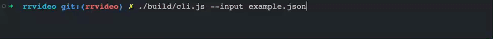

# rrvideo

## Overview

[中文文档](./README.zh_CN.md)

rrvideo is a tool for transforming the session recorded by [rrweb](https://github.com/rrweb-io/rrweb) into a video.



## Install rrvideo

1. Install [Node.JS](https://nodejs.org/en/download/)。
2. Run `npm i -g rrvideo` to install the rrvideo CLI.

## Use rrvideo

### Transform a rrweb session(in JSON format) into a video.

```shell
rrvideo --input PATH_TO_YOUR_RRWEB_EVENTS_FILE
```

Running this command will output a `rrvideo-output.webm` file in the current working directory.

### Config the output path

```shell
rrvideo --input PATH_TO_YOUR_RRWEB_EVENTS_FILE --output OUTPUT_PATH
```

### Config the replay

You can prepare a rrvideo config file and pass it to CLI.

```shell
rrvideo --input PATH_TO_YOUR_RRWEB_EVENTS_JSON_FILE --config PATH_TO_YOUR_RRVIDEO_CONFIG_FILE
```

You can find an example of the rrvideo config file [here](./rrvideo.config.example.json).

### High fps / MP4 (ffmpeg backend)

Playwright `recordVideo` (the default for `.webm` output) is CDP
screencast. Chromium typically delivers ~10–25fps and Playwright's
bundled encoder writes VP8 WebM, so this path cannot do high-fps MP4.

The ffmpeg backend starts playback once, advances a controlled JavaScript clock,
takes a JPEG screenshot, and writes it to ffmpeg (`libx264`). It waits for each
write before advancing. Output fps is fixed even when capture is slower than
real time. JavaScript playback follows the output timeline; ordinary screenshots
do not synchronize native CSS animations, audio, video, or animated images.

```shell
# 60fps MP4. Requires ffmpeg on PATH.
rrvideo --input PATH_TO_YOUR_RRWEB_EVENTS_FILE --output session.mp4 --fps 60
```

`.mp4` output (or `--fps`) selects this backend automatically. You can
also set `"capture": "ffmpeg"` in the config file.

Playback speed (`speed` 2 or 4 in the config file) shortens the file: a
60s session at `speed: 4` and `--fps 60` becomes a 15s 60fps MP4. It
does not drop the encoded frame rate.

For many sessions, use `transformMany(jobs, { concurrency })`. Each job
is its own Chromium + ffmpeg process. Keep concurrency around CPU cores;
1080p/60fps screenshotting is CPU-bound. Splitting **one** long session
across workers is not supported yet.

`pixelRatio: 2` screenshots at 2× CSS pixels for sharper output.
`width` / `height` in the config file set the viewport.

Seeking with `goto` applies mouse-move batches synchronously, so the
cursor jumps to the last position in each recorded event rather than
interpolating every 16ms. DOM mutations still land on the correct
frame. That is an rrweb seek limitation, not an fps cap.

The [Browserless Playwright recorder](https://github.com/browserless/examples/tree/main/examples/record-browser-session/frameworks/playwright)
is also a real-time screencast (`Browserless.startRecording` → WebM).
It does not expose fps, buffers the whole file as base64, and needs a
headed Browserless session — so it has the same high-fps / parallel /
MP4 limits as Playwright `recordVideo`.

## Sponsors

[Become a sponsor](https://opencollective.com/rrweb#sponsor) and get your logo on our README on Github with a link to your site.

### Gold Sponsors 🥇

<div dir="auto">

<a href="https://opencollective.com/rrweb/tiers/gold-sponsor/0/website?requireActive=false" target="_blank"></a>
<a href="https://opencollective.com/rrweb/tiers/gold-sponsor/1/website?requireActive=false" target="_blank"></a>
<a href="https://opencollective.com/rrweb/tiers/gold-sponsor/2/website?requireActive=false" target="_blank"></a>
<a href="https://opencollective.com/rrweb/tiers/gold-sponsor/3/website?requireActive=false" target="_blank"></a>
<a href="https://opencollective.com/rrweb/tiers/gold-sponsor/4/website?requireActive=false" target="_blank"></a>
<a href="https://opencollective.com/rrweb/tiers/gold-sponsor/5/website?requireActive=false" target="_blank"></a>
<a href="https://opencollective.com/rrweb/tiers/gold-sponsor/6/website?requireActive=false" target="_blank"></a>

</div>

### Silver Sponsors 🥈

<div dir="auto">

<a href="https://opencollective.com/rrweb/tiers/silver-sponsor/0/website?requireActive=false" target="_blank"></a>
<a href="https://opencollective.com/rrweb/tiers/silver-sponsor/1/website?requireActive=false" target="_blank"></a>
<a href="https://opencollective.com/rrweb/tiers/silver-sponsor/2/website?requireActive=false" target="_blank"></a>
<a href="https://opencollective.com/rrweb/tiers/silver-sponsor/3/website?requireActive=false" target="_blank"></a>
<a href="https://opencollective.com/rrweb/tiers/silver-sponsor/4/website?requireActive=false" target="_blank"></a>
<a href="https://opencollective.com/rrweb/tiers/silver-sponsor/5/website?requireActive=false" target="_blank"></a>
<a href="https://opencollective.com/rrweb/tiers/silver-sponsor/6/website?requireActive=false" target="_blank"></a>

</div>

### Bronze Sponsors 🥉

<div dir="auto">

<a href="https://opencollective.com/rrweb/tiers/sponsors/0/website?requireActive=false" target="_blank"></a>
<a href="https://opencollective.com/rrweb/tiers/sponsors/1/website?requireActive=false" target="_blank"></a>
<a href="https://opencollective.com/rrweb/tiers/sponsors/2/website?requireActive=false" target="_blank"></a>
<a href="https://opencollective.com/rrweb/tiers/sponsors/3/website?requireActive=false" target="_blank"></a>
<a href="https://opencollective.com/rrweb/tiers/sponsors/4/website?requireActive=false" target="_blank"></a>
<a href="https://opencollective.com/rrweb/tiers/sponsors/5/website?requireActive=false" target="_blank"></a>
<a href="https://opencollective.com/rrweb/tiers/sponsors/6/website?requireActive=false" target="_blank"></a>
<a href="https://opencollective.com/rrweb/tiers/sponsors/7/website?requireActive=false" target="_blank"></a>
<a href="https://opencollective.com/rrweb/tiers/sponsors/8/website?requireActive=false" target="_blank"></a>

</div>

### Backers

<a href="https://opencollective.com/rrweb#sponsor" rel="nofollow"></a>

## Core Team Members

<table>
  <tr>
    <td align="center">
      <a href="https://github.com/Yuyz0112">
        
        <br /><sub><b>Yuyz0112</b></sub>
        <br /><br />
      </a>
    </td>
    <td align="center">
      <a href="https://github.com/YunFeng0817">
        
        <br /><sub><b>Yun Feng</b></sub>
        <br /><br />
      </a>
    </td>
    <td align="center">
      <a href="https://github.com/eoghanmurray">
        
        <br /><sub><b>eoghanmurray</b></sub>
        <br /><br />
      </a>
    </td>
    <td align="center">
      <a href="https://github.com/Juice10">
        
        <br /><sub><b>Juice10</b></sub>
        <br /><sub>open for rrweb consulting</sub>
      </a>
    </td>
  </tr>
</table>

## Who's using rrweb?

<table>
  <tr>
    <td align="center">
      <a href="http://www.smartx.com/" target="_blank">
        
      </a>
    </td>
    <td align="center">
      <a href="https://posthog.com?utm_source=rrweb&utm_medium=sponsorship&utm_campaign=open-source-sponsorship" target="_blank">
        
      </a>
    </td>
    <td align="center">
      <a href="https://statcounter.com/session-replay/" target="_blank">
        
      </a>
    </td>
    <td align="center">
      <a href="https://recordonce.com/" target="_blank">
        
      </a>
    </td>
  </tr>
  <tr>
    <td align="center">
      <a href="https://sentry.io" target="_blank">
        
      </a>
    </td>
    <td align="center">
      <a href="https://www.pendo.io" target="_blank">
        
      </a>
    </td>
    <td align="center">
      <a href="https://mixpanel.com" target="_blank">
        
      </a>
    </td>
    <td align="center">
      <a href="https://www.datadoghq.com" target="_blank">
        
      </a>
    </td>
  </tr>
  <tr>
    <td align="center">
      <a href="https://amplitude.com" target="_blank">
        
      </a>
    </td>
    <td align="center">
      <a href="https://newrelic.com" target="_blank">
        
      </a>
    </td>
    <td align="center">
      <a href="https://cux.io" target="_blank">
        
      </a>
    </td>
    <td align="center">
      <a href="https://remsupp.com" target="_blank">
        
      </a>
    </td>
  </tr>
  <tr>
    <td align="center">
      <a href="https://highlight.io" target="_blank">
        
      </a>
    </td>
    <td align="center">
      <a href="https://analyzee.io" target="_blank">
        
      </a>
    </td>
    <td align="center">
      <a href="https://requestly.io" target="_blank">
        
      </a>
    </td>
    <td align="center">
      <a href="https://gleap.io" target="_blank">
        
      </a>
    </td>
  </tr>
  <tr>
    <td align="center">
      <a href="https://uxwizz.com" target="_blank">
        
      </a>
    </td>
    <td align="center">
      <a href="https://www.howdygo.com" target="_blank">
        
      </a>
    </td>
  </tr>
</table>

### Experimental compositor capture

On Linux or Windows, `--capture compositor` uses Chrome headless shell's
`HeadlessExperimental.beginFrame` with native virtual time to advance rendering,
JavaScript, and CSS animation together. It shares the FFmpeg encoder and settings
with `--capture ffmpeg`.
Compositor capture supports up to 1000 FPS. Frame timestamps use whole
milliseconds, matching rrweb recordings; sampling rounds down by less than one
millisecond while the encoded frame rate stays exact. Missing compositor images
are retried at strictly increasing one-microsecond drawing timestamps, with the
replay clock paused. Recovery is limited to ten attempts and less than the next
frame timestamp; later frames keep their original timing.
It requires a headless shell with begin-frame support. Playwright installs one
with `playwright install chromium`. Use `--browserPath /path/to/chrome-headless-shell`
to select another binary. Regular Chrome and new-headless mode are unsupported.

```shell
rrvideo --input events.json --capture compositor --output session.mp4 --fps 30
```

macOS users should use `--capture ffmpeg`, or run both modes inside Linux Docker.
Compositor capture fails explicitly on macOS; it does not silently fall back.
The viewport stays fixed at the recording's maximum size. Neither mode guarantees
deterministic network resources or native media playback.

Both frame modes reject `skipInactive: true`, since skipping time conflicts with
the fixed output timeline. They support these additional CLI/config options:

| Option             | Default               | Purpose                                                                                     |
| ------------------ | --------------------- | ------------------------------------------------------------------------------------------- |
| `captureTimeoutMs` | `30000`               | Deadline for initialization, each frame/write, and encoder finalization                     |
| `browserPath`      | Playwright executable | Choose a Chromium executable; compositor requires headless shell                            |
| `replayMode`       | `incremental`         | Use `seek` with the ffmpeg backend to compare per-frame seeking and screenshots             |
| `frameDelayMs`     | `0`                   | Artificial wall-clock delay per frame for diagnostics; must be less than `captureTimeoutMs` |

`captureTimeoutMs` also covers encoder finalization. Large outputs on slow disks
may need a larger value while FFmpeg prepares the MP4 for playback.

Unavailable media rejections and unrelated page errors are logged. A synchronous
error in the controlled replay animation loop fails conversion with its original
diagnostic. With `--capture ffmpeg`, a failed Playwright clock advance also fails
conversion, including exceptions from timer callbacks. Compositor mode logs
unrelated native timer errors and continues. Native media playback remains
best-effort.

A failed frame conversion removes its temporary video and preserves any existing
output. Encoder errors propagate to the caller, including premature successful
exit. See [the benchmark guide](benchmark/README.md) to compare both modes on the
same machine and inspect the resulting videos.
